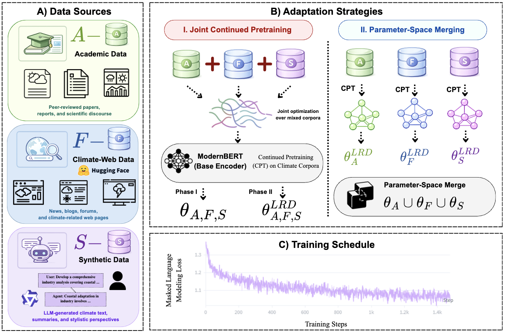

# ClimateModernBERT

**Climate-ModernBERT: Revisiting Corpus Composition for Domain-Adaptive Continued Pretraining**

A family of climate-domain encoders obtained by continued pretraining of ModernBERT-Base
on three climate corpora — academic climate text, climate-filtered web data, and synthetic
climate text — and a study of whether those sources are better combined *during* training
or *after* it, in parameter space.

[**Project website**](https://michaelyya.github.io/ClimateModernBERT/) ·
[**Paper (PDF)**](./paper/climate-modernbert.pdf) ·
[**Models on Hugging Face**](https://huggingface.co/CMB-ClimateModernBERT) ·
[**Model inventory**](./docs/model-inventory.md)

<div align="center">
    
</div>

> The manuscript is **unpublished and under review**. There is no venue, DOI or arXiv
> identifier yet, and no citation to give.

---

## Overview

We construct a 6.42B-token climate corpus from three sources and continue-pretraining
ModernBERT-Base on every non-empty subset of them, following ModernBERT's own two-phase
schedule. We then compare that against merging independently specialized checkpoints in
parameter space under matched data coverage.

| | Corpus | Format | Docs | Tokens |
|---|---|---|---|---|
| 𝒜 | Academic — journals, ClimateNews 2000–2022, climate arXiv, handbooks | XML / CSV / PDF | ~5M | ~1.28B |
| ℱ | Climate Web — FineWeb-Edu after keyword + FastText climate filtering | Parquet | 2.59M | ~5B |
| 𝒮 | Synthetic — LLM-generated climate text from in-domain seeds | JSONL | ~20K | ~0.14B |
| | **Total** | | | **~6.42B** |

Two training stages per configuration:

- **Phase 1 · context extension (`CX`)** — 3 epochs, constant LR 3e-4, global batch 576,
  sequence length 8,192, MLM 30%.
- **Phase 2 · LRD specialization (`CX_LRD`)** — 3 further epochs on a `1 − √t` decay
  schedule. These are the primary climate-adapted models; Phase-1 checkpoints are kept as
  an ablation.

21 adapted variants were evaluated across nine climate NLP benchmarks — over 810
fine-tuning runs.

## Key findings

1. **Academic climate text provides the strongest adaptation signal.** Every adapted
   variant matches or beats the ModernBERT-Base baseline (73.5 avg F1), and the
   academic-only Phase-1 model reaches the highest average of any jointly trained
   configuration at **75.3**.
2. **More heterogeneous data does not automatically help.** Adding sources to 𝒜 lowers
   average Phase-1 F1 from 75.3 to 74.8 (𝒜+𝒮) and 74.1 (𝒜+𝒮+ℱ). Synthetic text in
   particular is task-dependent — significantly helping TCFD and Specificity while
   consistently degrading Commitments & Actions.
3. **Parameter-space merging beats joint training on the same data.** Uniform weight
   averaging of the three single-source checkpoints reaches **76.3** average F1, above both
   the strongest single source (74.5) and joint training on the full union (74.8). The
   source task vectors are nearly orthogonal (pairwise cosine 0.06–0.18).

## Model collection

The paper's checkpoints are published under
[**CMB-ClimateModernBERT**](https://huggingface.co/CMB-ClimateModernBERT). Names are the corpus
set in `A_S_F` order, then the training stage — `CX` for Phase 1, `CX_LRD` for Phase 1 + Phase 2:

| Use case | Checkpoint | Avg F1 |
|---|---|---|
| **General use** | [`Merge_Soup_LRD`](https://huggingface.co/CMB-ClimateModernBERT/Merge_Soup_LRD) — uniform weight average of the three single-source models | **76.3** |
| Best single (non-merged) | [`A_CX`](https://huggingface.co/CMB-ClimateModernBERT/A_CX) — academic only, Phase 1 | 75.3 |
| Joint training on the union | [`A_S_F_CX_LRD`](https://huggingface.co/CMB-ClimateModernBERT/A_S_F_CX_LRD) | 74.8 |

<details>
<summary>All 25 republished checkpoints</summary>

**Jointly trained.** `A_CX` · `S_CX` · `F_CX` · `A_S_CX` · `A_F_CX` and their `_CX_LRD`
counterparts, plus `S_F_CX_LRD` and `A_S_F_CX_LRD`. The {𝒮, ℱ} and {𝒜, 𝒮, ℱ} Phase-1
checkpoints were never published.

**Merged (Table 4).** `Merge_Soup_LRD` · `Merge_TA_L10_LRD` · `Merge_TA_L05_LRD` ·
`Merge_TIES_D07_LRD` · `Merge_TIES_D05_LRD` · `Merge_DARE_D05_LRD` · `Merge_DARE_D07_LRD`

**Appendix F.** `Merge_Norm_LRD` · `Merge_Soup_CX` · `Merge_Norm_CX`

**Figure 2 drop-one ablations.** `Merge_Soup_drop_A_LRD` · `Merge_Soup_drop_S_LRD` ·
`Merge_Soup_drop_F_LRD`

</details>

The original [`sraj/*`](https://huggingface.co/sraj) repositories are **untouched** — nothing was
renamed or deleted there, so existing links and the merge configs still resolve. Those names are
historical experiment identifiers: `MARK` and `ZYDA` are both academic components of 𝒜, `WX_SYN`
and `SYN` are synthetic data, and `FWEdu_V2_FastTxt` is ℱ after FastText filtering.
[`docs/model-naming.md`](./docs/model-naming.md) maps the two schemes and records what is still
unconfirmed; [`docs/model-inventory.md`](./docs/model-inventory.md) catalogues all 56 checkpoints.

```python
from transformers import AutoTokenizer, AutoModel   # transformers >= 4.48

model_id = "CMB-ClimateModernBERT/Merge_Soup_LRD"
tokenizer = AutoTokenizer.from_pretrained(model_id)
model = AutoModel.from_pretrained(model_id)
```

ModernBERT is native to `transformers` from 4.48 onward, so no `trust_remote_code` is needed.

## Repository structure

```
ClimateModernBERT/
├── continue_pretrain/        # Phase 1 + Phase 2 CPT (Composer / FlexBERT)
│   ├── context_ext.sh                                  # SLURM: launch Phase 1
│   ├── lr_decay.sh                                     # SLURM: launch Phase 2
│   ├── modernbert-base-context-extension.yaml          # Phase 1 hyperparams (§3.2)
│   ├── modernbert-base-learning-rate-decay.yaml        # Phase 2 hyperparams (§3.2)
│   ├── requirements.txt
│   └── data_pipeline/
│       ├── nemo_climate.sh                             # SLURM: dedup pipeline
│       ├── nemo_pipeline_climate.py                    # NeMo-Curator: clean → exact dedup → fuzzy dedup → JSONL
│       ├── run_fineweb_filter.sh                       # SLURM: launch FineWeb-Edu climate filter
│       └── stream_filter_upload_fineweb.py             # Stage-1 keyword filter + async HF Hub upload (§3.1, ℱ)
│
├── src/
│   ├── data/                  # Academic-corpus prep (𝒜)
│   │   ├── download_and_process_gdrive.py              # Pull raw journal exports
│   │   ├── extract_xml_text.py, extract_xml_for_dedup.py
│   │   ├── decontaminate.py, decontaminate_check.py, decontaminate_large.py
│   │   ├── deduplication.py, dedup_instructions.md     # Google's suffix-array dedup (see third_party/)
│   │   ├── process_all_datasets.py, create_final_dataset.sh
│   │   └── count_tokens.py
│   └── synthetic/             # Synthetic corpus (𝒮)
│       ├── climatenew_vllm.py                          # Driver: seed → prompts → generation → JSONL
│       ├── chat.py, vllm_utils.py                      # Local OpenAI-compatible client + decoding configs
│       └── scripts/data_creation{,_1,_2}.sh            # Three SLURM jobs at seeds 42/43/44
│
├── model_merging/             # Post-hoc parameter-space merging (§4)
│   ├── merge.sh                                        # Driver: runs mergekit + pushes to HF Hub
│   └── merge_configs/                                  # 10 mergekit YAMLs (Soup, TA, TIES, DARE, drop-one)
│
├── eval/                      # Downstream fine-tuning + benchmark eval (§4.3, §5)
│   ├── config_updated.json                             # 9 tasks incl. ClimRetrieve
│   ├── config_without_GLUE.json                        # 8 tasks (no retrieval)
│   ├── multitask_finetuning_updated.py                 # n=3 seed fine-tuning
│   ├── multitask_finetuning_10seeds.py                 # n=10 paired-seed (synthetic ablation in §5.1)
│   ├── benchmark_evaluation_updated.py                 # Score saved checkpoints
│   ├── run_multitask.sh, run_multitask_pipeline.sh     # SLURM entry points
│   └── README.md                                       # Eval-side usage notes
│
├── utils/                     # Format conversions and HF Hub uploads
│   ├── convert_any_to_mds.py + run_hf_to_mds.sh        # JSONL/HF → MosaicML Streaming (MDS) shards for CPT
│   ├── convert_to_hf.py + convert_to_hf.sh             # Composer checkpoint → HF Transformers (FlexBERT)
│   ├── upload_to_hub.py + upload_to_hub.sh             # Push HF-format checkpoints to the Hub
│   └── count_tokens.py                                 # Rough token tally on an MDS dataset
│
├── third_party/
│   └── deduplicate-text-datasets/                      # Google submodule used by src/data/deduplication.py
│
├── paper/climate-modernbert.pdf                        # The manuscript
├── docs/                                               # Model naming guide + full checkpoint inventory
├── huggingface/                                        # Model-card template, manifest, and renderer
├── scripts/generate-docs.ts                            # Regenerates docs + manifest from the site data
└── site/                                               # Astro project website (GitHub Pages)
```

## Reproduction

Four stages. Each runs independently if you bring your own intermediate artifacts.

### 1. Data preparation

**Academic (𝒜, ~1.28B tokens after dedup; §3.1, App. B).**
Raw journal XML/PDF lives outside this repo. Use `src/data/extract_xml_text.py` and the PDF
helpers in `src/data/` to lift cleaned text, then run `src/data/deduplication.py` (which
calls the Google suffix-array tool vendored under `third_party/deduplicate-text-datasets/`)
followed by `src/data/decontaminate.py` against the nine downstream eval sets.

**Web (ℱ, ~5B tokens; §3.1, App. C).**
`continue_pretrain/data_pipeline/run_fineweb_filter.sh` streams FineWeb-Edu through the
keyword filter and a FastText classifier (threshold 0.5) and pushes survivors to an HF Hub
dataset shard-by-shard. Edit `DATASET`, `HUB_REPO_ID`, and `SUBSET` at the top of the shell
script.

**Synthetic (𝒮, ~0.14B tokens; §3.1, App. D).**
Seed excerpts (first 800 chars of each in-domain doc) are fed to a vLLM-served generator.
The three style templates ("public awareness", "industry perspective", "environmental
journalism") are hard-coded in `src/synthetic/climatenew_vllm.py`.
`src/synthetic/scripts/data_creation{,_1,_2}.sh` are the same job at seeds 42 / 43 / 44 for
variance.

All three corpora then pass through
`continue_pretrain/data_pipeline/nemo_pipeline_climate.py` (text cleaning → exact MD5 dedup
→ fuzzy MinHash–LSH with 24-char n-grams, 20 bands, 13 hashes/band; §App. A). The output is
a single JSONL per corpus.

### 2. Pack into MDS shards

`utils/convert_any_to_mds.py` is the one place you wire your JSONL paths and HF dataset refs
into a single MosaicML Streaming dataset. The `data_local` field in the Composer YAMLs
points at this output directory.

### 3. Two-stage continued pretraining (§3.2)

```bash
# Phase 1 — domain adaptation at constant LR=3e-4, 3 epochs, MLM 30%, batch 576, seqlen 8192.
sbatch continue_pretrain/context_ext.sh

# Phase 2 — LRD specialization (1 - sqrt(t) schedule, alpha_f=1e-3), 3 more epochs.
# Set `load_path` in the YAML to your Phase-1 checkpoint, then:
sbatch continue_pretrain/lr_decay.sh
```

For each non-empty subset X ⊆ {𝒜, 𝒮, ℱ} you want, re-point `data_local` and `run_name` and
re-run. That gives the 7 Phase-1 + 7 Phase-2 = 14 joint-training checkpoints in Table 2 of
the paper.

### 4. Model conversion

`utils/convert_to_hf.sh` converts a Composer `.pt` checkpoint into HF Transformers FlexBERT
format; `utils/upload_to_hub.sh` then pushes it.

### 5. Parameter-space merging (§4)

The 7 merged variants in Table 3 come from `model_merging/merge_configs/`:

- `merge_all.yaml` — uniform Soup of {𝒜, ℱ, 𝒮}
- `merge_ta_lambda{05,10}.yaml` — Task Arithmetic, λ ∈ {0.5, 1.0}
- `merge_ties_d{05,07}.yaml` — TIES, drop ratio d ∈ {0.5, 0.7}
- `merge_dare_d{05,07}.yaml` — DARE-TIES, d ∈ {0.5, 0.7}
- `merge_drop_{A,F,S}.yaml` — drop-one Soups for the §5.2 ablation (radar plot)

Drop your HF repo IDs into each YAML (the placeholder is `xxx/CMB_A`, etc.) and:

```bash
cd model_merging
bash merge.sh
```

The merge configurations actually used for the released checkpoints are recorded in each
merged repository's `mergekit_config.yml` on the Hub, and reproduced in
[`docs/model-inventory.md`](./docs/model-inventory.md).

### 6. Downstream evaluation (§4.3, §5)

```bash
cd eval
# n=3 seeds, all 9 tasks
bash run_multitask_pipeline.sh
# or, for the §5.1 paired-seed synthetic ablation (n=10):
python multitask_finetuning_10seeds.py --config_file config_updated.json --seeds 42 123 456 7 13 21 34 55 89 144
python benchmark_evaluation_updated.py --config_file config_updated.json --seeds 42 123 456 7 13 21 34 55 89 144
```

Edit `eval/config_updated.json` to point `base_model_path` at the HF repo (or local dir) of
the checkpoint you want to fine-tune. The shared fine-tuning recipe (LR 4e-5, eff. batch 64,
up to 10 epochs with early stopping on val F1, BF16 fused AdamW) follows §4.3 of the paper
and is in `defaults.training`.

### Datasets used in evaluation

All are loaded via `datasets.load_dataset`; ClimRetrieve is local CSV.

| Task | HF dataset |
|---|---|
| Climate Detection | `climatebert/climate_detection` |
| Climate Specificity | `climatebert/climate_specificity` |
| Climate Sentiment | `climatebert/climate_sentiment` |
| Commitments & Actions | `climatebert/climate_commitments_actions` |
| Net Zero & Reduction | `climatebert/netzero_reduction_data` |
| TCFD Recommendations | `climatebert/tcfd_recommendations` |
| Environmental Claims | `climatebert/environmental_claims` |
| WFB Nature | `ESGBERT/WaterForestBiodiversityNature_2200` |
| WXImpactBench | `Michaelyya/wximpactbench-1386` |
| ClimRetrieve | Local CSV — point `local_data_path` at the ClimRetrieve report-level file |

### Environment

Tested on 4× A100 (Phase 1 takes ~7 days on the academic corpus, less on the others; Phase 2
is ~1 day). Key versions are pinned in `continue_pretrain/requirements.txt` — most importantly
`mosaicml>=0.22,<0.23`, `mosaicml-streaming==0.7.6`, `transformers==4.40.2`, `torch==2.3.0`,
`flash-attn==2.6.3`.

The merge step needs `mergekit` (installed inline by `merge.sh`). The synthetic-data step
needs a vLLM server.

The repo is set up for SLURM (you'll see `#SBATCH` directives and a
`module load dev2025a cuda/12.x` at the top of each launcher). If you're on a different
cluster, swap those lines and the `/scratch/xxx`, `/home/xxx`, `--account=xxx` placeholders
for whatever your site uses.

## Project website

The site lives in [`site/`](./site) and is a static Astro build deployed to GitHub Pages by
[`.github/workflows/deploy-pages.yml`](./.github/workflows/deploy-pages.yml).

```bash
cd site
npm install
npm run dev      # http://localhost:4321/ClimateModernBERT/
npm run build    # static output in site/dist/
npm run preview  # serve the production build
npm run check    # astro check (typecheck)
```

All content is rendered from four data files — nothing is hard-coded in a component:

| File | Contents |
|---|---|
| `site/src/data/project.ts` | Corpora, training recipe, findings, repository map |
| `site/src/data/results.ts` | Every number transcribed from the manuscript's tables |
| `site/src/data/models.ts` | The canonical checkpoint manifest |
| `site/src/data/naming.ts` | Legacy-name ↔ paper-notation mapping, plus a parser |

`docs/model-inventory.md` and `huggingface/manifests/models.json` are **generated** from
those files. After editing `models.ts`, regenerate them:

```bash
cd site && npx tsx ../scripts/generate-docs.ts
```

To republish checkpoints into the organization (idempotent; never writes to `sraj/*`):

```bash
export HF_TOKEN=...                       # never commit this
python scripts/migrate_to_org.py          # dry run: print the plan
python scripts/migrate_to_org.py --push   # create repos, upload weights + model cards
```

`astro.config.mjs` sets `base: "/ClimateModernBERT"`. Renaming the repository means changing
that value.

## Paper

[`paper/climate-modernbert.pdf`](./paper/climate-modernbert.pdf) — the current manuscript.

## Citation

**Coming soon.** The manuscript is under review; there is no venue, DOI or arXiv identifier
to cite. Please check back here or watch this repository for citation details once it is
public.

## License and data notes

- **Code.** The training, merging and evaluation code in this repository is released for
  research use. `third_party/deduplicate-text-datasets/` is a Google submodule under its own
  license.
- **Models.** Checkpoint licenses are set on each Hugging Face repository. Several carry no
  license field yet; we do not assign one on their behalf here. Check the model page before
  redistributing.
- **Data.** Raw academic text is **not** redistributed. Peer-reviewed articles are accessed
  under institutional publisher licenses; arXiv preprints are under arXiv terms; news shards
  and climate handbooks were collected for non-commercial research use. We release model
  checkpoints and data-processing pipelines where permitted, not the raw text.
